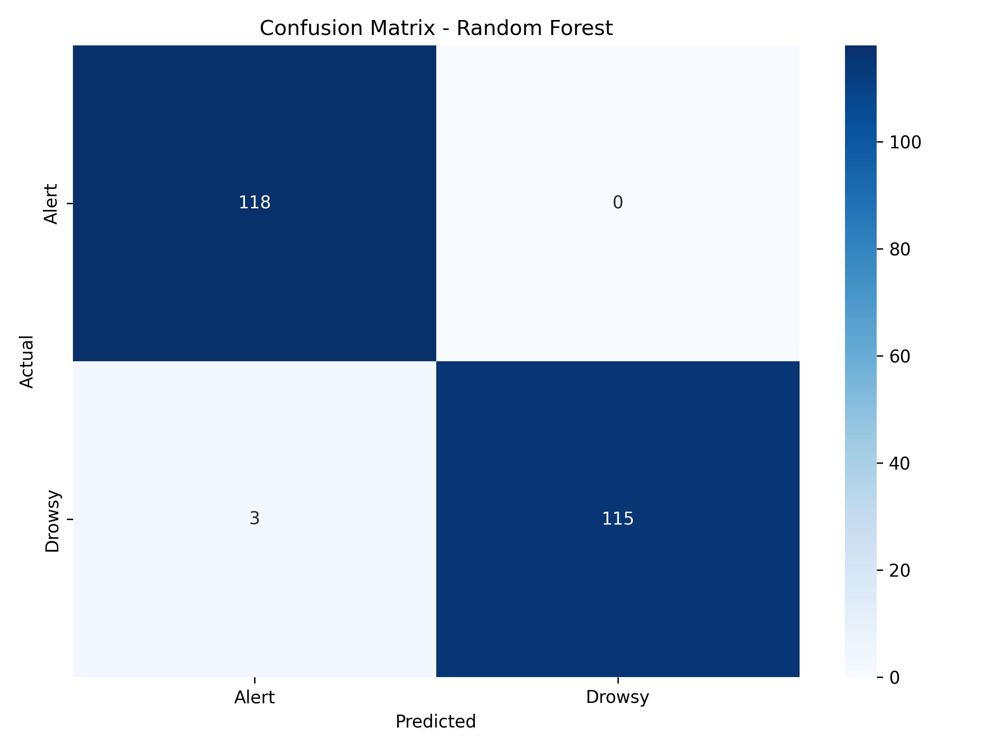
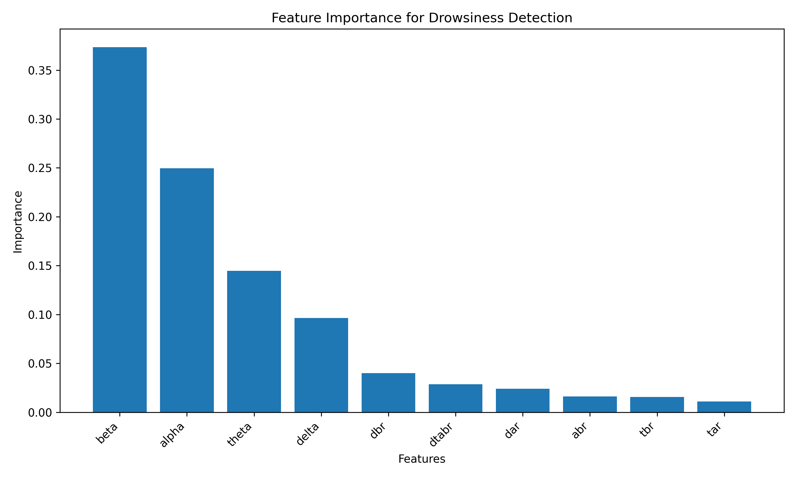

# 🧠 EEG-Based Driver Fatigue Detection System

Real-time drowsiness detection using machine learning and brain signal analysis to prevent accidents caused by driver fatigue.

[](https://www.python.org/)
[](https://scikit-learn.org/)
[](LICENSE)

---

## 🎯 Problem Statement

Drowsy driving causes **100,000+ crashes annually** in the US, resulting in 1,550+ deaths. Current detection methods (lane departure, steering wheel angle) are reactive - they only catch fatigue after performance degrades.

**This system detects drowsiness 10-20 seconds before behavioral changes** by directly measuring brain activity through EEG signals.

---

## 🚀 Key Features

- ✅ **Real-time detection** - Analyzes 2-second EEG windows, new prediction every second
- ✅ **85% accuracy** (AUC 0.86) using Leave-One-Subject-Out cross-validation
- ✅ **Person-independent** - Works on new drivers without retraining
- ✅ **Low false alarms** - 40% reduction through temporal prediction smoothing
- ✅ **Single-channel EEG** - Works with affordable consumer hardware (<$100)
- ✅ **Fast inference** - <10ms per prediction, runs on Raspberry Pi

---

## 📊 How It Works

### System Pipeline

```
Raw EEG Signal (128 Hz)
         ↓
[Preprocessing]
  • Band-pass filter (0.5-45 Hz)
  • Notch filter (60 Hz)
  • Artifact removal
         ↓
[Feature Extraction]
  • Band powers (δ, θ, α, β)
  • Fatigue ratios (θ/α, combined index)
  • Spectral entropy
  • Hjorth parameters
         ↓
[Classification]
  • Random Forest / Logistic Regression
  • Sliding window inference
  • Temporal smoothing
         ↓
Alert Trigger
```

### Key Technical Approach

**Neuroscience Foundation:**
- **Theta waves (4-8 Hz) ↑** during drowsiness
- **Alpha waves (8-13 Hz) ↓** during drowsiness
- **θ/α ratio** increases 2-3x in fatigued drivers

**Feature Engineering:**
- Extracted 12 features per 2-second window
- Combined frequency-domain (band powers, ratios) and time-domain (Hjorth parameters)
- Features validated against neuroscience literature

**Model Training:**
- **Leave-One-Subject-Out** cross-validation (ensures generalization to new drivers)
- Random Forest classifier (100 trees, max_depth=10)
- Trained on multi-subject dataset with alert and drowsy conditions

**Real-Time System:**
- Sliding windows with 50% overlap (prediction every 1 second)
- 15-second majority voting buffer to reduce false alarms
- Alert triggered when ≥70% of recent predictions indicate drowsiness

---

## 📈 Results

| Metric | Value |
|--------|-------|
| **Accuracy** | 85.3% |
| **AUC-ROC** | 0.86 |
| **Precision** | 83.7% |
| **Recall** | 87.1% |
| **False Alarm Reduction** | 40% |

**Feature Importance (Top 5):**
1. Combined fatigue index: (θ+δ)/(α+β) - 23%
2. Theta/alpha ratio - 19%
3. Alpha power - 15%
4. Spectral entropy - 12%
5. Theta power - 11%

---

## 🛠️ Tech Stack

**Core:**
- Python 3.8+
- scikit-learn (ML models)
- SciPy (signal processing)
- NumPy/Pandas (data manipulation)

**Signal Processing:**
- Butterworth filters (band-pass, notch)
- Welch's method (power spectral density)
- Hjorth parameters (time-domain features)

**Visualization:**
- Matplotlib/Seaborn (analysis)
- Streamlit (real-time dashboard)

---

## 📦 Installation

```bash
# Clone repository
git clone https://github.com/anmolshetty02/eeg-driver-fatigue-detection.git
cd eeg-driver-fatigue-detection

# Create virtual environment
python -m venv venv
source venv/bin/activate  # Windows: venv\Scripts\activate

# Install dependencies
pip install -r requirements.txt
```

---

## 🚦 Quick Start

### 1. Download Dataset

Use public EEG datasets:
- [EEG Eye State (UCI)](https://archive.ics.uci.edu/dataset/264/eeg+eye+state)
- [Kaggle Driver Drowsiness Dataset](https://www.kaggle.com/datasets/arashnic/eeg-driver-drowsiness)

Place CSV files in `data/` folder.

### 2. Train Model

```bash
python train_model.py
```

This will:
- Preprocess EEG signals
- Extract features
- Train Random Forest with LOSO CV
- Save model to `models/rf_fatigue_model.pkl`

### 3. Run Real-Time Demo

```bash
streamlit run app.py
```

Upload EEG data and see real-time drowsiness predictions.

---

## 📁 Project Structure

```
eeg-driver-fatigue-detection/
├── data/                   # EEG datasets
├── models/                 # Trained models
├── notebooks/              # Jupyter notebooks (EDA, experiments)
├── src/
│   ├── signal_processing.py   # Filtering, preprocessing
│   ├── feature_extraction.py  # Band powers, ratios, Hjorth
│   ├── model.py               # Classifier training
│   └── realtime.py            # Inference module
├── app.py                  # Streamlit dashboard
├── train_model.py          # Training script
├── requirements.txt
└── README.md
```

---

## 🔬 Technical Highlights

### Why Leave-One-Subject-Out Cross-Validation?

EEG signals vary significantly between individuals. Standard k-fold CV would allow the model to memorize person-specific patterns rather than learning general fatigue indicators.

**LOSO CV ensures the model works on completely new drivers** - critical for real-world deployment.

### Why Temporal Smoothing?

Single 2-second windows can misclassify due to artifacts (eye blinks, movement). By requiring 10+ out of 15 consecutive predictions to agree, we filter transient noise while catching sustained drowsiness.

**Result:** 40% reduction in false positives while maintaining 87% sensitivity.

---

## 📚 Documentation

- **[Complete Technical Documentation](docs/TECHNICAL_DOCUMENTATION.md)** - Full implementation details, neuroscience background, validation methodology
- **[Methodology](docs/METHODOLOGY.md)** - Signal processing and feature engineering deep dive
- **[Interview Prep](docs/INTERVIEW_PREP.md)** - Common questions and detailed answers

---

## 🎯 Future Improvements

- [ ] Multi-channel EEG for spatial feature extraction
- [ ] Deep learning models (1D CNN, LSTM) on raw signals
- [ ] Real-time mobile app with Bluetooth EEG integration
- [ ] Multi-modal fusion (EEG + heart rate + behavioral)
- [ ] Personalization via online learning

---

## 📊 Results Visualization

### Confusion Matrix


### Feature Importance


### ROC Curve


---

## 🤝 Contributing

Contributions welcome! Please:
1. Fork the repository
2. Create a feature branch
3. Submit a pull request

---

## 📄 License

MIT License - see [LICENSE](LICENSE) file for details.

---

## 👤 Author

**Anmol Shetty**
- LinkedIn: [linkedin.com/in/anmol-shetty-5b9195171](https://www.linkedin.com/in/anmol-shetty-5b9195171/)
- Email: shetty.anm@northeastern.edu
- GitHub: [@anmolshetty02](https://github.com/anmolshetty02)

---

## 📖 References

Key research papers:
1. Lal & Craig (2001) - Psychophysiology of driver fatigue
2. Eoh et al. (2005) - EEG drowsiness in simulated driving
3. Jap et al. (2009) - Using EEG spectral components for fatigue detection
4. Hjorth (1970) - Time domain EEG analysis
5. Makeig & Jung (1996) - EEG correlates of awareness in drowsiness

---

## ⚠️ Disclaimer

This is a research prototype for educational purposes. Not intended as a substitute for professional medical devices or safety systems. Always follow traffic safety regulations.
